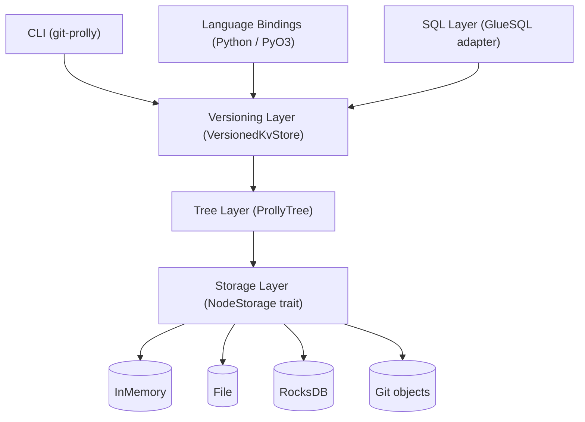

# Architecture

ProllyTree is built as a **layered library**. Each layer adds one capability on top of the layer below and depends on only the public surface of what it sits on. You can use any layer standalone.

## System architecture



- **Storage layer** — `NodeStorage` trait. Stores content-addressed nodes keyed by their hash. Pluggable: in-memory, file, RocksDB, or Git object store.
- **Tree layer** — `ProllyTree`. The probabilistic-B-tree / Merkle-tree hybrid. This is where inserts, lookups, proofs, and root-hash computation live.
- **Versioning layer** — `VersionedKvStore`. Git-like commits, branches, and three-way merges, expressed as a series of tree snapshots.
- **SQL layer** — GlueSQL adapter that treats a tree as a set of relational tables.
- **CLI** — `git-prolly`, the user-facing shell for the versioning + SQL layers.
- **Language bindings** — PyO3 bindings expose the whole stack to Python.

## Layers in detail

### 1. Storage layer — `NodeStorage`

The storage layer provides pure content-addressed persistence: "here is a node, its hash is its address." The tree never sees where a node actually lives.

Trait surface (simplified):

```rust
pub trait NodeStorage<const N: usize> {
    fn get_node_by_hash(&self, hash: &[u8; N]) -> Option<Node<N>>;
    fn insert_node(&mut self, node: Node<N>) -> [u8; N];
    fn delete_node(&mut self, hash: &[u8; N]) -> bool;
    fn save_config(&self, key: &str, value: &[u8]);
    fn get_config(&self, key: &str) -> Option<Vec<u8>>;
}
```

Implementations:

- **`InMemoryNodeStorage`** — a `HashMap`. Fast, volatile, thread-safe.
- **`FileNodeStorage`** — one file per node, hex-named by hash. Persistent, simple, not concurrent-safe.
- **`RocksDBNodeStorage`** — LSM-tree backend with LRU cache, block cache, bloom filters, and tuned compression. Production target.
- **`GitNodeStorage`** — nodes as Git blob objects. Experimental; see the caveats in [Storage Backends](storage.md).

### 2. Tree layer — `ProllyTree`

The core data structure. Built around a few ideas:

- **Nodes carry batches of entries**, not single keys — this is the B-tree half.
- **Node boundaries are chosen by a content-defined predicate over keys**, not by count — this is the prolly half, and it's what makes the tree shape depend only on the set of keys, not on the insertion order.
- **Each node is addressed by the hash of its serialised contents**, including the hashes of its children. This is the Merkle half.

For the mathematical construction and the specific balancing rule, see [Theory → Prolly Trees](theory/prolly_tree.md) and [Theory → Probabilistic Balancing](theory/rolling_hash.md).

Operations the tree exposes:

- `insert(key, value)`, `update(key, value)`, `delete(key)`
- `insert_batch(entries)`, `update_batch(entries)` — amortised rebalancing
- `find(key)` — returns the leaf node containing the key
- `generate_proof(key)` / `verify(proof, key, value)` — Merkle inclusion proofs
- `root_hash()` — a stable fingerprint of the whole dataset
- `diff(other)` — walks two trees in parallel and enumerates changed keys

### 3. Versioning layer — `VersionedKvStore`

A thin layer over `ProllyTree` that records commits, branches, and merges. It uses real Git as the commit graph — every `commit(msg)` becomes a Git commit, and branches are Git branches.

Three-way merge happens at the key-value level, not the byte level:

1. Walk the diff between `base` and `source` branches.
2. Walk the diff between `base` and `dest` branches.
3. Apply non-conflicting changes directly.
4. For keys modified on both sides, delegate to a conflict resolver (`IgnoreAll`, `TakeSource`, `TakeDestination`).

This is dramatically more reliable than text merges and is what makes the `git-prolly` CLI usable for real KV workflows. See [Theory → Versioning & Merge](theory/versioning.md).

### 4. SQL layer

The SQL layer is a GlueSQL [`Store`](https://github.com/gluesql/gluesql/blob/main/core/src/store/mod.rs) adapter backed by the versioned tree. Tables become key namespaces; rows become values. Everything persists and versions through the layer below.

See [SQL Interface](sql.md).

### 5. CLI — `git-prolly`

Wraps the versioning and SQL layers in a Git-like command surface. Designed to be familiar if you've used `git` itself:

```
git-prolly init | set | get | delete | list
git-prolly commit | log | status | show
git-prolly branch | checkout | merge | revert
git-prolly diff | history | keys-at | stats
git-prolly sql [-b <ref>] [--format json|csv|table]
```

Full reference: [CLI → git-prolly](cli.md).

### 6. Language bindings — PyO3

Python exposes:

- `ProllyTree`, `TreeConfig`
- `VersionedKvStore`, `ConflictResolution`, `MergeConflict`
- `ProllySQLStore`

The binding is a thin wrapper — Rust objects are held behind `Arc<Mutex<…>>` and Python types are PyO3 newtypes over them. See the [Python API reference](api/python.md).

## Data flow

### Write path (versioned store)

```text
client.insert(key, value)
  ↓
VersionedKvStore: stages change on current branch
  ↓
ProllyTree: insert into in-memory tree
  ↓
NodeStorage: persist any dirtied nodes by content hash
  ↓
client.commit("msg")
  ↓
VersionedKvStore: record new root hash as a Git commit
```

### Read path (historical query)

```text
client.sql("SELECT …", branch="v1.0")
  ↓
SQL adapter resolves ref → commit hash → root hash
  ↓
ProllyTree loads from NodeStorage using that root
  ↓
GlueSQL walks the tree as a relational scan
```

## Concurrency

- `InMemoryNodeStorage` is internally locked and safe for multiple threads.
- `VersionedKvStore` has a `git_threadsafe` variant — `StoreFactory::git_threadsafe::<32, _>(path)` — that wraps the underlying state in locks suitable for concurrent readers.
- Worktree support (`WorktreeManager`) lets multiple writers operate on independent branches of the same Git-backed store. See [Examples → Versioned Store](examples/versioning.md).

## Extension points

- **New storage backend** — implement `NodeStorage<N>`.
- **New conflict resolver** — implement `ConflictResolver` and pass it to `merge_with`.
- **New language binding** — the Rust surface is stable and PyO3-friendly; the shape of the Python module is a good blueprint.

## Design decisions worth knowing

- **Content-defined shape.** The one non-negotiable design choice. It enables equal root hashes for equal data, efficient diff, and convergent replicas. See [Theory → Prolly Trees](theory/prolly_tree.md).
- **Git-as-commit-graph.** Rather than reimplement a commit DAG, the versioning layer uses real Git. You get tooling (`git log`, GitHub, etc.) for free.
- **Bytes in / bytes out.** Keys and values are `Vec<u8>`. Higher layers (SQL, application code) can serialize whatever they like.
