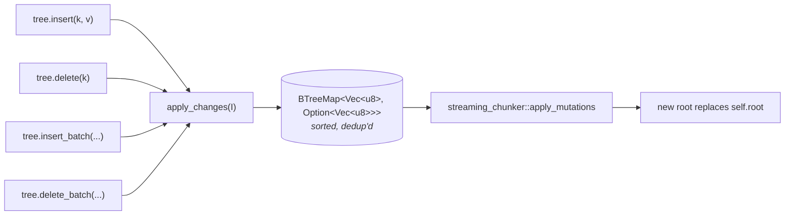
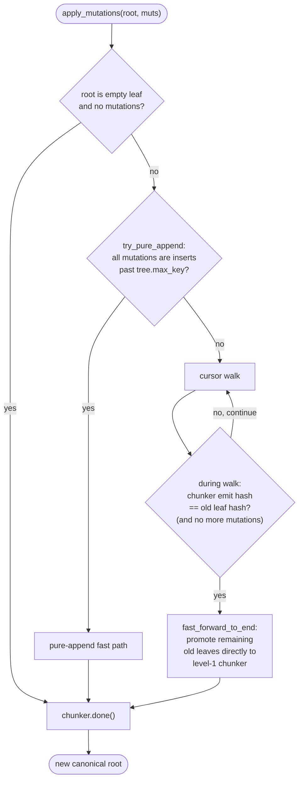
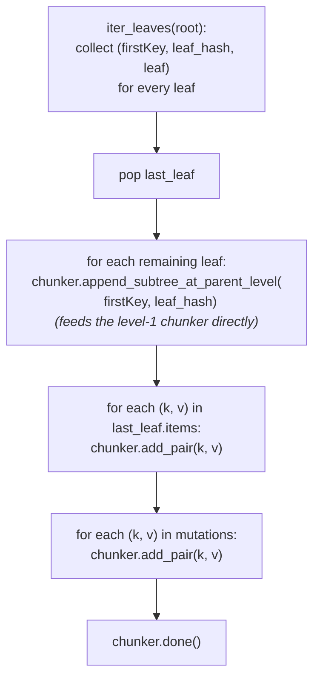
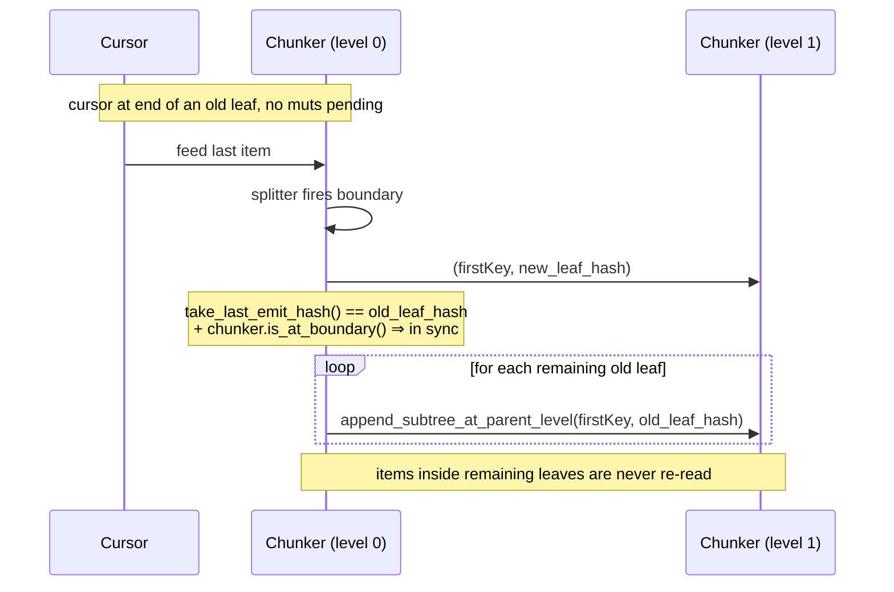
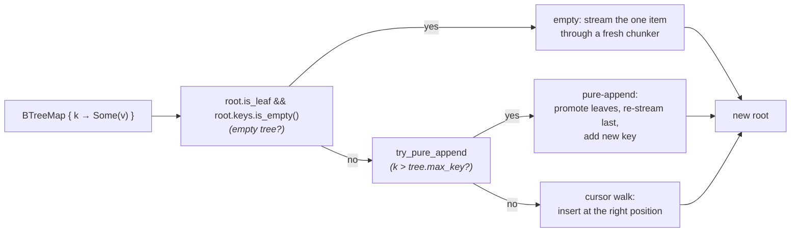
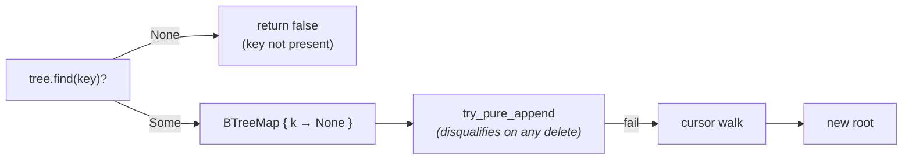

# Mutations & the Streaming Chunker

This page explains what happens between the moment a caller invokes
`tree.insert(...)` and the moment a new canonical root hash lands on
storage. The same pipeline handles `insert`, `delete`, `insert_batch`,
and `delete_batch` — there is no special-case path for any of them.

The property the pipeline buys you: **the resulting root hash depends
only on the final `(key, value)` set and the `TreeConfig`, not on the
order in which the mutations arrived.** This is history independence
expressed as a property of the algorithm rather than something patched
on afterwards. See [Probabilistic Balancing](rolling_hash.md) for the
boundary rule that makes this possible; this page is about how the
mutation engine uses that rule.

## The funnel: every mutation routes through one path



The wrappers are intentionally thin:

```rust
fn insert(&mut self, key: Vec<u8>, value: Vec<u8>) {
    self.apply_changes(std::iter::once((key, Some(value))));
    self.persist_root();
}

fn delete(&mut self, key: &[u8]) -> bool {
    if self.find(key).is_none() { return false; }
    self.apply_changes(std::iter::once((key.to_vec(), None)));
    self.persist_root();
    true
}
```

`apply_changes` itself does just three things:

1. Collect the batch into a `BTreeMap` — gives sorted iteration and
   last-write-wins deduplication for free.
2. Probe `find()` once per delete to compute the
   "missing-deletes" return value.
3. Call `streaming_chunker::apply_mutations(self.root.clone(), map, &self.config, &mut self.storage)`
   and install the returned root.

The interesting work all happens inside `apply_mutations`.

## The streaming chunker

`apply_mutations` walks the old tree with a **`NodeCursor`** and feeds
items to a **`Chunker`** which produces a new canonical tree. The
chunker has three cooperating parts:

```mermaid
flowchart LR
    subgraph C0["Chunker (level 0)"]
        direction TB
        S0["Splitter<br/>rolling-hash window<br/>resets at every boundary"]
        B0["NodeBuilder<br/>in-progress chunk<br/>(keys, values)"]
        S0 -->|"boundary?<br/>(hash &amp; pattern) == pattern"| B0
    end
    subgraph C1["Chunker (level 1) — created lazily"]
        direction TB
        S1["Splitter"]
        B1["NodeBuilder"]
        S1 --> B1
    end
    subgraph Cn["Chunker (level 2, 3, …)<br/>recursively, until 1 chunk left"]
    end
    KV["(key, value)<br/>stream"]
    Out["canonical root<br/>(possibly multi-level)"]

    KV --> C0
    C0 -->|on emit:<br/>(firstKey, leaf_hash)| C1
    C1 -->|on emit:<br/>(firstKey, internal_hash)| Cn
    Cn --> Out
```

- **`Splitter`** sees every appended item and maintains a rolling hash
  over the last `min_chunk_size` items. When `hash & pattern == pattern`
  the splitter declares a *boundary* and is reset. Because state is
  reset at every boundary, the next chunk's decision depends only on
  items inside that chunk — never on prior history. (Details:
  [Probabilistic Balancing](rolling_hash.md).)
- **`NodeBuilder`** holds the keys and values for the chunk currently
  being assembled.
- **`Chunker`** is the streaming driver: takes items in sorted order,
  feeds them through the splitter and builder, and when the splitter
  fires it seals the builder into a `ProllyNode`, writes it to storage,
  and forwards `(firstKey, hash)` to a parent chunker one level up. The
  parent is created lazily on first need.

## Walking through `apply_mutations`

Below, `root` is the current tree, `muts` is the sorted mutation map.



The cursor walk is the general case; the two fast paths are
optimisations.

### The cursor walk (general case)

A `NodeCursor` is a linked list of cursors, one per tree level, each
pointing at a `(node, idx)` pair. `at_start` descends to the leftmost
leaf; `advance` moves the leaf-level idx forward, recursively bumping
parents when a leaf is exhausted and re-descending into the next leaf.

For each cursor position the inner loop merges in any pending
mutations:

| cmp(mutation.key, cur.key) | action |
|---|---|
| `Less` | The mutation is an insert before `cur`. Feed `(mk, mv)` to the chunker (deletes here are no-ops). Don't advance the cursor. |
| `Equal` | The mutation targets the current key. If `Some(v)`, feed `(cur.key, v)` to the chunker (overwrite). If `None`, drop the item (delete). Consume the mutation. |
| `Greater` | The mutation applies to a later key. Pass the current cursor key/value through unchanged. |

After processing the cursor position, advance. Repeat until the cursor
is exhausted, then drain any mutations that fell past the end of the
tree.

### Pure-append fast path

Triggered when *every* mutation is an insert with `key > tree.max_key`
— common in append-only and monotonic-key workloads (time-series,
log structures). When it fires, the tree's existing leaves are
guaranteed unchanged except for the last one.



The cost is `O(|last_leaf| + |new_keys|)` — the earlier leaves never
have their items read or re-hashed. The last leaf has to be
re-streamed because the splitter may have decided a different boundary
at its right edge once the new keys merge in.

### Alignment-aware fast-forward

Triggered during the cursor walk when there are no mutations left and
the chunker just emitted a chunk whose hash equals the leaf the cursor
was about to leave. At that moment the chunker is back "in sync" with
the old tree: subsequent unchanged old leaves can be promoted directly
to the level-1 chunker without their items being re-fed through the
splitter.



The hash comparison is the alignment check. Computing the leaf hash
requires a `SHA-256` over the leaf's bytes; this is done lazily —
only when the cursor is about to cross a leaf boundary *and* the
mutation queue is empty — so it doesn't cost anything on the hot path.

## What each operation looks like end-to-end

### `insert(key, value)`



### `delete(key)`



A delete is just an entry whose value is `None`. When the cursor meets
a matching key the item is simply not fed to the chunker — the new
tree never sees it. There's no special "compact empty leaves"
post-pass because empty leaves can't form: the chunker emits a leaf
only when its builder has items.

### `insert_batch(keys, values)`

Identical to `insert` except the BTreeMap holds many entries. If all
of them are past `tree.max_key` the pure-append fast path applies and
amortises the per-item cost across the batch.

### `delete_batch(keys)`

Identical to `delete` for a batch: BTreeMap entries are all
`(k, None)`, pure-append disqualifies, the cursor walk drops every
matched item in a single pass.

## Why this is history-independent

The cursor walk reads from the old tree in **sorted key order**, and
the merge with the mutation map preserves that order. Whatever
mutation history produced the old tree, the chunker only ever sees a
sorted stream of the *final* `(key, value)` set. The splitter resets
at every boundary, so each chunk's decision depends only on its own
contents.

Two consequences:

1. **The same final key set produces the same chunks**, no matter what
   order they were inserted in.
2. **The same chunks produce the same internal nodes**, recursively,
   all the way to the root.

So the root hash is a function of the data alone — replicas that
independently arrive at the same `(key, value)` set converge to
exactly the same root, with no coordination.

## See also

- [Probabilistic Balancing](rolling_hash.md) for the rolling-hash
  predicate and the chunk-size distribution.
- [Merkle Properties & Proofs](merkle.md) for what the root hash
  actually proves and how subtree sharing lets you sync replicas in
  time proportional to the *change*, not the store size.
- [Versioning & Merge](versioning.md) for how this mutation pipeline
  composes with commits, branches, and three-way merge.
