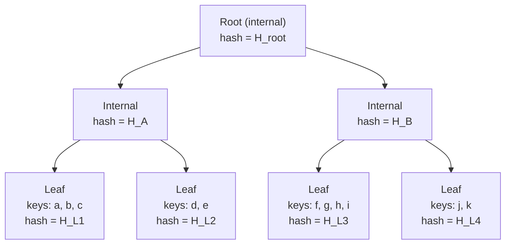

# Prolly Trees

A **prolly tree** (*probabilistic* tree) is a content-defined variant of a B-tree whose node boundaries are determined by the data itself, not by a rebalancing policy. Every node is content-addressed, so the whole structure behaves like a Merkle tree.

This page is a conceptual tour: what the tree *is*, what invariants it maintains, and what falls out of those invariants. The next page, [Probabilistic Balancing](rolling_hash.md), gives the specific balancing rule and proves the O(log n) depth.

## Motivation — why not "B-tree" or "Merkle tree"?

Take the two canonical structures and list what they're good at:

| Property | B-tree | Merkle tree |
|---|---|---|
| O(log n) point lookup | ✅ | ✅ |
| O(log n) range scan | ✅ | ❌ (leaves are not ordered) |
| Content-addressed / verifiable | ❌ | ✅ |
| Equal data ⇒ equal structure | ❌ (shape depends on insertion order) | ❌ (same issue for any dynamic Merkle tree) |
| Cheap diff between two versions | ❌ | ✅ (compare subtree hashes) |

A B-tree is ordered and logarithmic but not content-addressed. A Merkle tree is content-addressed but:

1. Its shape depends on how you built it — two Merkle trees containing the same keys can have different root hashes.
2. Leaves aren't kept in an order that makes range scans cheap.

A prolly tree is both. It's a **balanced, ordered, content-addressed, history-independent** tree.

## The core idea

A prolly tree is a B-tree in which **each node contains a prefix of the sorted keyspace** — as in any B-tree — but the decision of *where one node ends and the next begins* is made by a content-defined predicate:

> For every key `k` inserted, the implementation computes a hash-derived predicate over `k` (and optionally over `k`'s neighborhood). If the predicate fires, `k` is the last key of its current node — the tree's leaf boundary lands there. Otherwise `k` continues the current node.

Because the predicate is a pure function of keys, **any two trees holding the same set of keys place their boundaries in the same places.** This is the defining property of the data structure. It is what you do not get from classical B-trees.

## What this buys you

1. **History independence.** Insert `{a, b, c}` in any order, or pour the set into a builder in one shot — you get the same tree, byte-for-byte, and therefore the same root hash.

2. **Convergent replicas.** Two peers with the same KV set have the same tree without running any consensus protocol. "Do we have the same data?" is a hash comparison.

3. **Efficient diff and sync.** To find the differences between two versions, walk both trees top-down in lockstep, skipping subtrees whose root hashes agree. The cost is proportional to the size of the *change*, not to the size of the stores.

4. **Locality for range scans.** Keys are still stored in sorted order within nodes, and nodes still cover a contiguous range of the keyspace. Range iteration is O(log n + k) as in a B-tree.

5. **O(log n) ops.** With a reasonable predicate, node sizes concentrate around a target average, and the tree height is Θ(log n). See [Probabilistic Balancing](rolling_hash.md).

## Structure

- **Leaf nodes** store sorted key/value pairs.
- **Internal nodes** store sorted keys paired with hashes of child nodes (not pointers — hashes).
- **Node boundaries** are chosen by the content-defined predicate described above. Nodes are not filled to a fixed fanout — they grow until the predicate fires.
- **Every node is serialised and hashed**; the hash of an internal node is computed from the hashes of its children, so the root hash authenticates the whole tree.

## Reading a prolly tree

A lookup for key `k` is exactly a B-tree lookup:

1. Start at the root.
2. Binary-search the node's separators to find the child that covers `k`.
3. Follow the child's hash to load the next node.
4. Repeat until you hit a leaf; binary-search for `k` inside the leaf.

Cost: O(log n) node loads, each one bounded by the node size.

## Writing a prolly tree

Inserts and updates are a two-phase operation:

1. **Find the leaf** that should hold `k` (as above).
2. **Insert into that leaf**, then *re-evaluate the boundary predicate* around the changed region. If the predicate's verdict has changed — a boundary that used to land between `k_prev` and `k_next` now lands differently — split or merge accordingly, and propagate the change up the tree, rewriting every ancestor's hash.

Because the predicate is local — it depends on a small window around the modified key — this only rewrites a path from the modified leaf up to the root, plus any sibling whose boundary moved. The amortised write cost stays O(log n).

## What "prolly" actually means here

"Prolly" is short for *probabilistic*. The word shows up because:

- The predicate that picks boundaries is a hash — in the aggregate over random keys, it behaves like an independent Bernoulli trial with known firing probability `p`.
- The *expected* node size is therefore `1/p`, and node sizes concentrate tightly around that mean (the sum of geometric random variables).
- The *expected* tree height is logarithmic in the number of keys, with a constant controlled by your choice of `p`.

So the tree is probabilistic in its *shape analysis*, not in its behaviour — the shape itself is a deterministic function of the key set.

## Comparison table

| | B-tree | Merkle tree | Prolly tree |
|---|---|---|---|
| Ordered leaves | ✅ | usually not | ✅ |
| Content-addressed | ❌ | ✅ | ✅ |
| Shape depends on history | ✅ (bad) | usually ✅ (bad) | ❌ (good) |
| O(log n) lookup | ✅ | ✅ | ✅ |
| Fast diff | ❌ | ✅ | ✅ |
| Range scan cost | O(log n + k) | O(n) | O(log n + k) |
| Convergent replicas | ❌ | ❌ | ✅ |

## Next

- **[Probabilistic Balancing](rolling_hash.md)** — the exact rule that picks node boundaries, why it's O(log n) in expectation, and what tuning parameters matter.
- **[Merkle Properties & Proofs](merkle.md)** — root hashes and inclusion proofs.
- **[Versioning & Merge](versioning.md)** — how commits, branches, and three-way merges layer on top of the tree.
