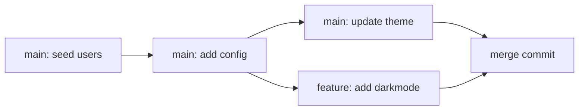

# Versioning & Merge

The `VersionedKvStore` turns a prolly tree into a Git-like versioned key-value store. This page explains what "Git-like" means concretely here — commits, branches, three-way merges, and the conflict-resolution hook — and why these operations are *cheap* thanks to the underlying tree.

If you haven't already, read [Prolly Trees](prolly_tree.md) and [Merkle Properties & Proofs](merkle.md) first. The merge algorithm relies on both history independence and cheap subtree diffs.

## The model

- **A commit** records the root hash of the tree at that moment, plus a commit message, author, parent(s), and timestamp — all stored as a real Git commit on the backing repo.
- **A branch** is a Git branch; its tip points at the latest commit on that branch.
- **The working state** is the current, possibly-uncommitted tree. Writes stage changes on the current branch.
- **A merge** combines the histories of two branches and produces a new commit with two parents.



Because commits record **root hashes**, not diffs, the version DAG is effectively a sequence of snapshots. The prolly tree keeps snapshots cheap to store — shared nodes are shared by hash in the `NodeStorage`.

## Three-way merge, key-value style

A classical text merge looks at two files line by line against a common base and tries to splice them. That falls apart on structured data because the "lines" aren't meaningful units.

ProllyTree merges at the **key-value level**:

1. Find the **base commit** — the lowest common ancestor of the two branches.
2. Compute `diff(base, source)` — the set of keys changed on the incoming branch.
3. Compute `diff(base, dest)` — the set of keys changed on the current branch.
4. **Partition** the changes into three buckets:
   - Keys changed only on `source` → apply directly.
   - Keys changed only on `dest` → already present.
   - Keys changed on **both** → potential conflicts; go to step 5.
5. For each conflict, delegate to a **ConflictResolver**. The resolver looks at `base`, `source`, and `dest` values and decides what wins.

Because tree diffs are cheap — remember, equal subtree hashes mean equal content, so you prune the walk aggressively — the whole merge is proportional to the size of the change, not the size of the stores.

### Why this is robust

- **No spurious conflicts** from reordered inserts: the tree shape is history-independent, so a leaf that received `{a=1, b=2}` in one order looks identical to one that received them in the other order.
- **No false positives** from serialisation drift: the comparison is on logical KV pairs, not on bytes.
- **Deterministic outcome** given a resolver: a resolver is a pure function of `(base, source, dest)`, so two merges with the same inputs produce the same output.

## Built-in conflict resolvers

| Resolver | Behaviour |
|---|---|
| `IgnoreConflictsResolver` / `ConflictResolution.IgnoreAll` | Keep the destination value. Conflicts are silently resolved in favour of the current branch. |
| `TakeSourceResolver` / `ConflictResolution.TakeSource` | Always prefer the source (incoming) value. |
| `TakeDestinationResolver` / `ConflictResolution.TakeDestination` | Always prefer the destination (current) value. |

All three are deterministic and commit-rewritable — you can re-run the merge and get the same result.

### Custom resolvers

The Rust-side `ConflictResolver` trait is a simple function:

```rust
pub trait ConflictResolver {
    fn resolve(
        &self,
        base: Option<&[u8]>,
        source: Option<&[u8]>,
        dest: Option<&[u8]>,
    ) -> Resolution;
}
```

A resolver can implement anything you like — last-write-wins using a timestamp in the value, JSON-patch merging, CRDT-style semantics, or an interactive prompt. The merge engine calls it exactly once per conflicting key.

## Probing for conflicts without merging

Sometimes you want to know whether a merge *would* succeed before you actually apply it. `try_merge` does exactly that — it walks the two diffs, classifies each change, and returns the list of conflicts without modifying state.

```python
ok, conflicts = store.try_merge("feature")
if not ok:
    for c in conflicts:
        print(c.key, "base:", c.base_value, "src:", c.source_value, "dst:", c.destination_value)
```

This is a lot cheaper than doing a merge, inspecting the result, and rolling back.

## Time travel

Because commits record root hashes, "what did the store look like at commit X?" is just "load the tree rooted at that hash." The `VersionedKvStore` exposes this directly; from the CLI you can also run SQL queries against a specific commit or branch:

```bash
git-prolly sql -b v1.0 "SELECT COUNT(*) FROM users"
git-prolly sql -b a1b2c3d4 "SELECT * FROM users WHERE id = 42"
```

These are read-only — historical commits are immutable, and the implementation refuses write queries against them. See the [SQL Interface](../sql.md) page for details.

## Interplay with the storage layer

The versioning layer sits on top of any `NodeStorage`. In practice the Git-backed backend is most useful because it:

- Stores nodes as Git blobs, keyed by content hash.
- Lets you use all of Git's distribution tooling (`git push`, GitHub remotes, signed tags) on your KV store.
- Keeps the commit graph as a real Git graph that tools like `git log` and `gitk` understand.

The RocksDB backend works just as well structurally, but you lose the Git-ecosystem niceties and manage the commit graph yourself (via the `VersionedKvStore` metadata). Most users should stay on the Git-backed backend unless they have measured a need to move.

## Back to practice

- The [`git-prolly` CLI reference](../cli.md) covers `branch`, `checkout`, `merge`, `diff`, `history`, `keys-at`, `revert`, `log`, and more.
- The [Versioned Store example](../examples/versioning.md) walks through a complete branch-and-merge workflow end-to-end.
- Return to the **[Theory overview](index.md)**.
